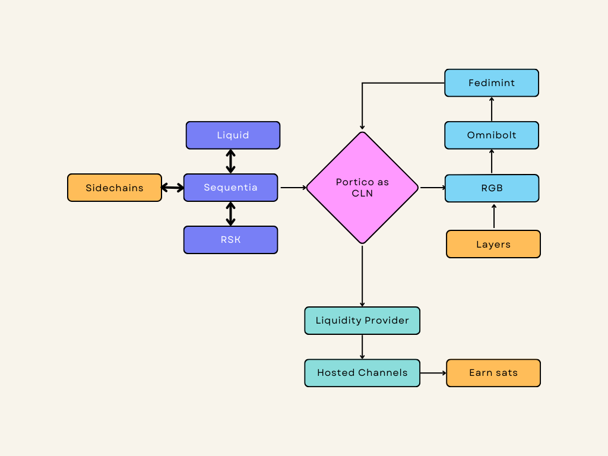
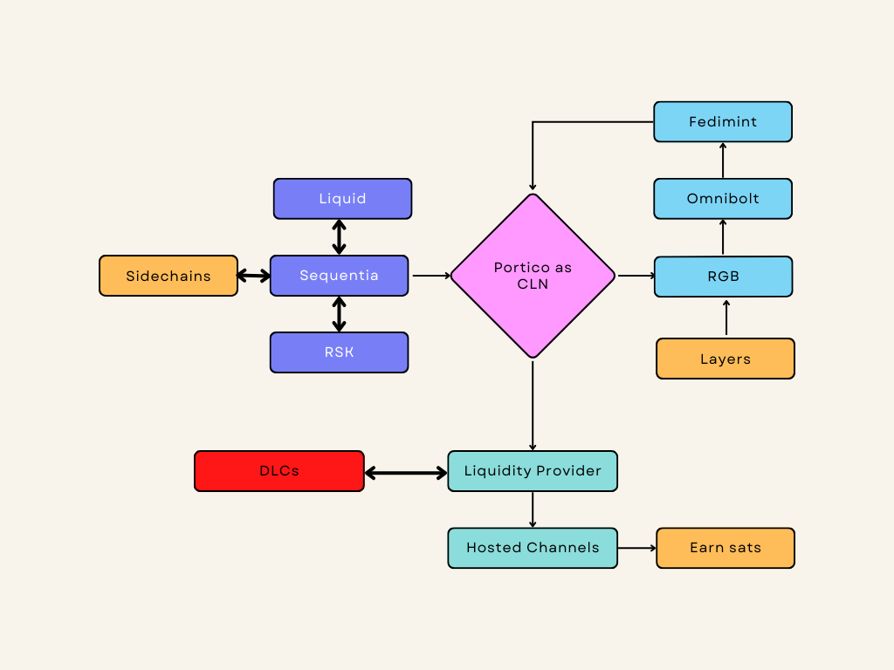

# Dex Fuctions

The Dex will have four parts:

* Atomic Swap
* Low fees (0.005%)
* Without KYC
* Lightning Native Swap

**HOW WORKS?**

For make Swap between chains different wil be necessary have HTLC(Hashed TimeLock contract), where alllow commucation with A and B that have information:

* sender
* recipient
* amount of BTC
* expiration
* hashlock=hash(secret\_A)
* PHold (Payment Hold)

Example: LBTC<>BTC:zap:.&#x20;

1. User A creates an HTLC on source layer with the desired LBTC (1 LBTC) to be swapped and B as the recipient (generally found and negotiated off-chain like 1 BTC on LN).
2. B checks if the source contract is correct and finalized, then  B will create another HTLC with reversed sender/recipient, i.e., sender = B and recipient = A with the amount of token (1 LBTC) that user A wishes to receive. An important note is that B will _**copy**_ the hashlock on the source contract even B has no idea the secret is.
3. User A checks if the destination contract matches the user’s swap request and is finalized, then user A will unlock 1 LBTC by revealing secret\_A.
4. At this moment, LP B can learn the secret and unlock 1 LBTC at the source contract, which completes the swap.
5.  And A received BTC on Lightning Network using Invoice (PHold).

 (1).jpg>)

**LIQUIDITY PROVIDER**

We'll use hosting channels or funding channels for create liquidity provider safe and unique.

Channel A<>L-BTC + BTC

Remember the L-BTC will be "token" synthetic inside Lightning

**GRAPHIC PORTICO 1**

<figure><figcaption></figcaption></figure>

**GRAPHIC PORTICO 2**

<figure><figcaption></figcaption></figure>

**FEATURES and COMPATIBILITY**

* Fedimint
* Lightning Network (LND/LDK/CLN)
* Liquid Network
* Sequentia
* Spacechain
* Softchain
* Statechain
* OmniBolt
* RGB&#x20;
* Fabric Protocol / PortalOS
* Tor and I2P
* Drivechains
* Ark
* BIP-199
* DLCs
* PTLCs
* DHT (HyperCore)
* Taproot
* Covenants
* Taproot Channels

